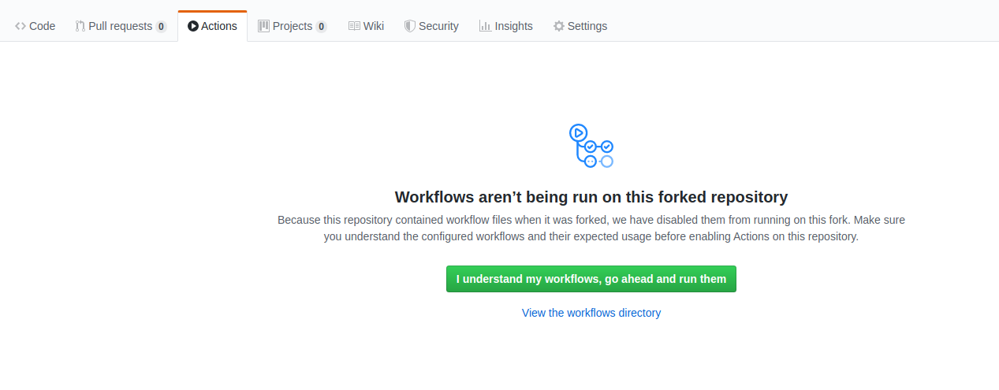

# Fix This CI

## Level 2 - failing action

- running a CI build on this branch causes an error:

- click the green button to enable actions, then push to the repo to trigger an action run (eg, there's currently a failing test, so fix and push that).

## Save the CI build!
- it looks like the text wasn't found. Hmmmm...that could be because the casing
is different.
`/hello, dear Users!/` in the test doesn't match `Hello, dear users!`
- ah ha! There are a couple ways to fix this...we could change the text to match
the test (we would do this if we wrote the test first, and that's definitely what
we want in our landing page), OR we could update the test to be case-insensitive.
- In this example, we'll just add an `i` to the end of the test regex to make it
ignore casing issues.
`/hello, dear Users!/` => `/hello, dear Users!/i`
- Now, push your changes back to your own repo to see if we fixed it.

- Looks like it worked, Hurray!

- now, checkout the `level-2` branch to try the next CI fix.
