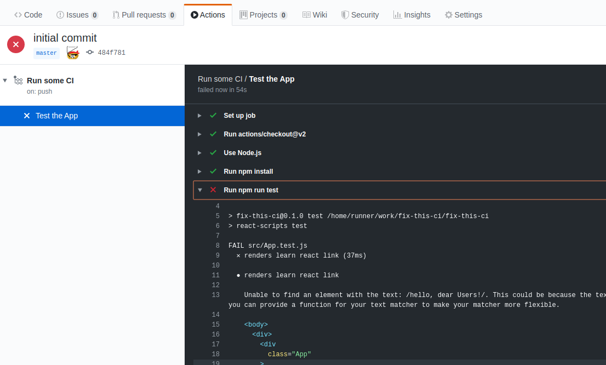
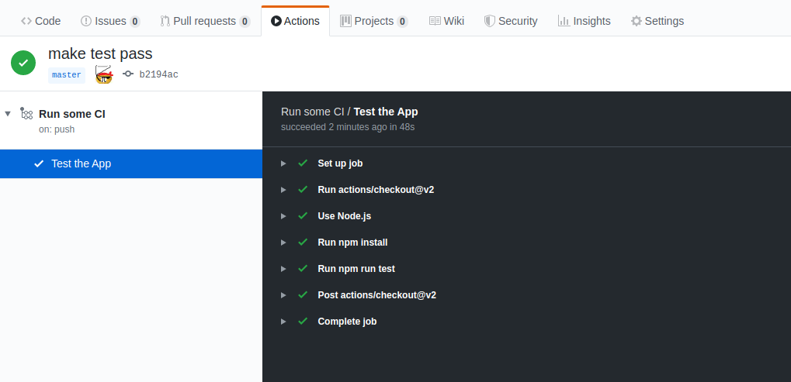

# Fix-This-CI

Actually working with CI pipelines is something that isn't often taught in CS 
or online programming courses, but it should be.

One of the barriers to this is providing opportunities for learners to actually
fix issues in actual pipelines. Just reading about them will give people plenty
of nice information, but they get better at it by actually doing it.

So this repo is an attempt at showing how we might be able to give learners
practice with finding and fixing issues in real (though contrived) pipelines.

## Running the exercises

- fork the repository (don't just clone it, you need to have a copy in your own
github account for the actions to work).
- go ahead and trigger a run of your actions workflow (this is specified in the
file `.github/workflows/ci.yml`, so take a look there if you want).

- looks like it failed, so let's fix it

## Save the CI build!
- it looks like the text wasn't found. Hmmmm...that could be because the casing
is different.
`/hello, dear Users!/` in the test doesn't match `Hello, dear users!`
- ah ha! There are a couple ways to fix this...we could change the text to match
the test (we would do this if we wrote the test first, and that's definitely what
we want in our landing page), OR we could update the test to be case-insensitive.
- In this example, we'll just add an `i` to the end of the test regex to make it
ignore casing issues.
`/hello, dear Users!/` => `/hello, dear Users!/i`
- Now, push your changes back to your own repo to see if we fixed it.

- Looks like it worked, Hurray!
